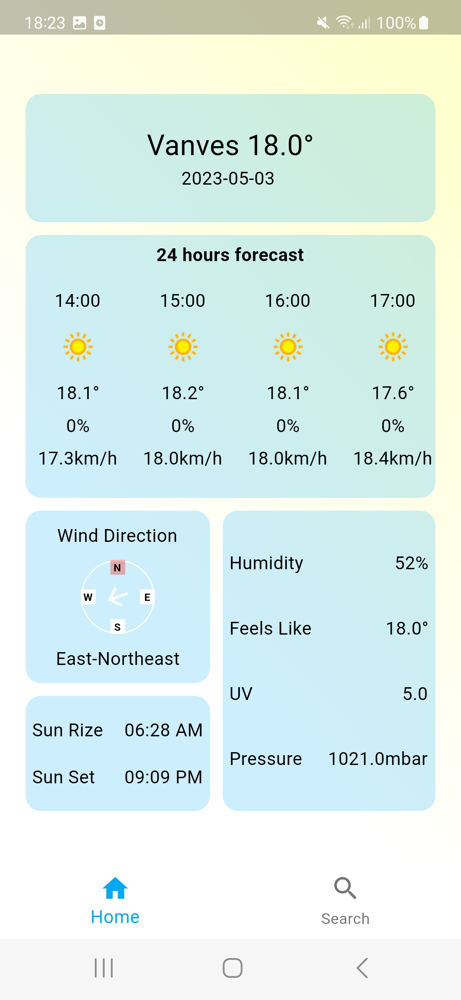
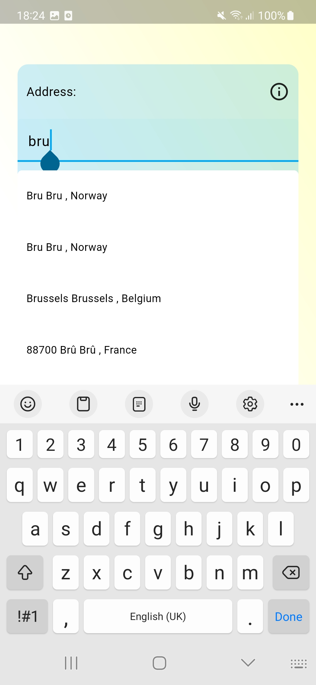
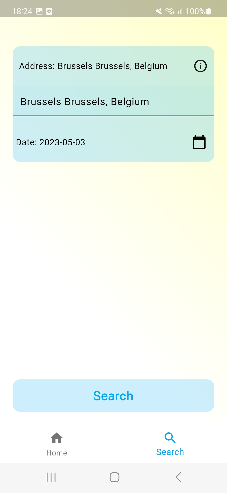
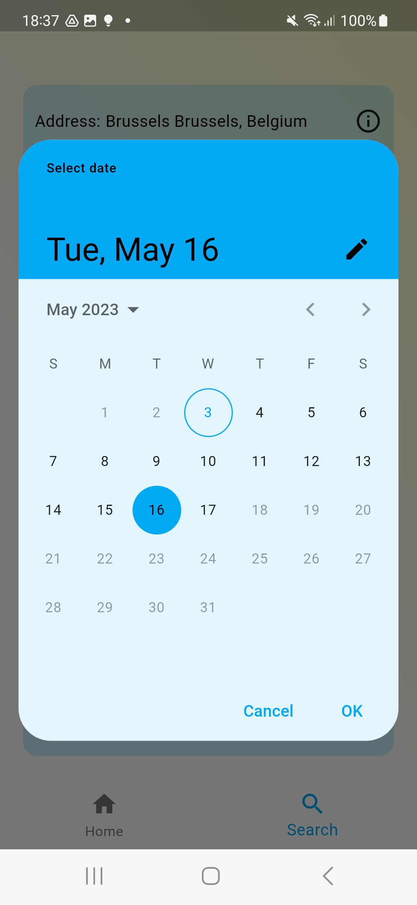
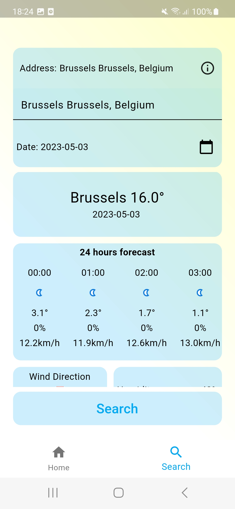
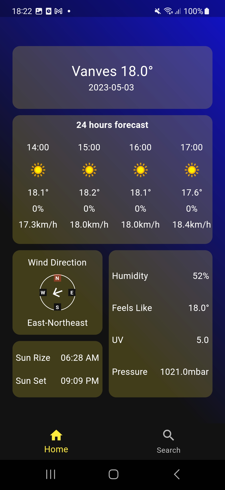
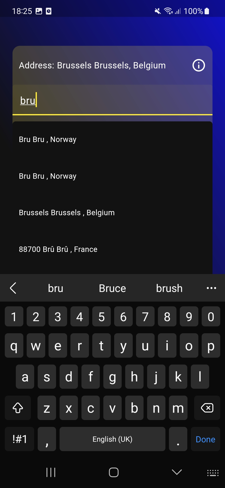
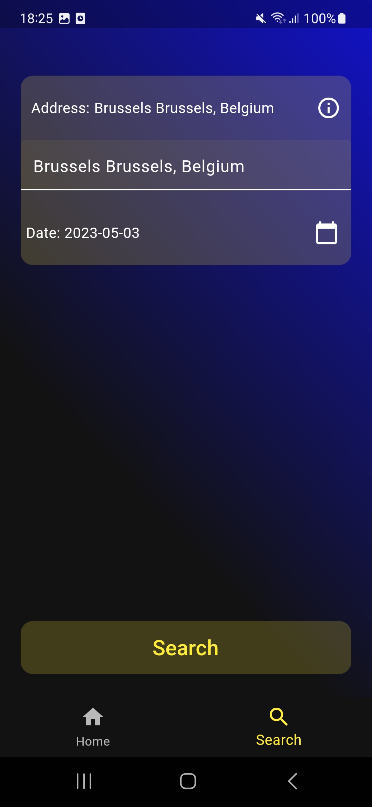
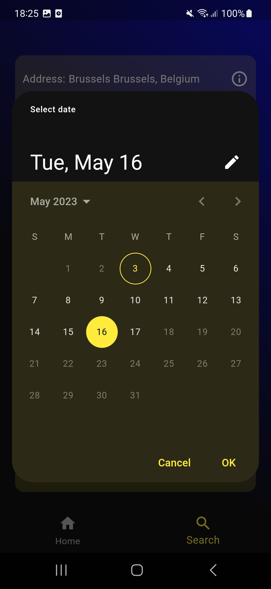
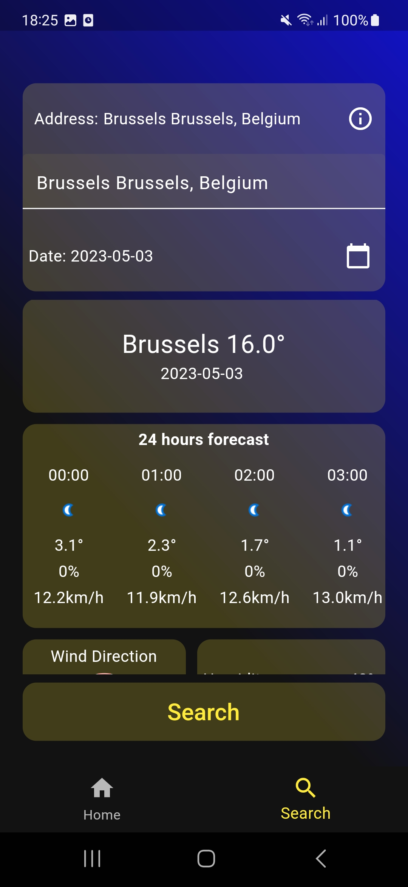

# flutter_weather_app_clean

This is a Flutter weather app that includes two main screens: DefaultWeatherPage and SearchWeatherPage.

* The DefaultWeatherPage takes device geolocation to request the current weather data from an [API](https://www.weatherapi.com/) .
* The SearchWeatherPage allows the user to input a location and provides autocomplete suggestions for the user's input. If the user selects one of the suggested locations, the app can retrieve its coordinates since the [autocomplete API](https://www.geoapify.com/address-autocomplete) provides an object containing the address coordinates. In the second screen, the user just needs to select a date and click the search button to get the forecast result.
## Screenshot

### Light Theme
<!-- Light Theme -->
<p align="center">
  
  
  
  
  
</p>

### Dark Theme
<!-- Dark Theme -->
<p align="center">
  
  
  
  
  
</p>
This app follows the clean architecture pattern, with the following folders in the `lib` directory:

* `locator.dart`
* `main.dart`
* `data`
* `domain`
* `foundation`
* `presentation`

## Getting Started
To run this app, you will need to create a .env file in the lib folder and add your API keys to it. The following variables are required:

- FORECAST_API_KEY: Your API key for the weather API.
- AUTOCOMPLETE_API_KEY: Your API key for the autocomplete API.

## Environment
To run this app correctly, you will need to create an .env file in the lib directory and add the API keys to it. Update the pubspec.yaml file to reflect these changes. Otherwise, the app will not run correctly and errors will occur.
```
assets:
   - ./.env
```

Make sure to add the dependencies listed in the pubspec.yaml file to your project before running the app.

## Dependencies

The following packages were used in this project:

```yaml
environment:
  sdk: '>=2.19.6 <3.0.0'

dependencies:
  flutter:
    sdk: flutter

  cupertino_icons: ^1.0.2
  flex_color_scheme: ^6.1.2
  auto_route: ^6.3.0
  provider: ^6.0.5
  get_it: ^7.2.0
  http: ^0.13.5
  dartz: ^0.10.1
  equatable: ^2.0.5
  flutter_dotenv: ^5.0.2
  intl: ^0.18.1
  geolocator: ^9.0.2
  internet_connection_checker: ^1.0.0+1

dev_dependencies:
  flutter_test:
    sdk: flutter

  flutter_lints: ^2.0.0
  build_runner: ^2.3.3
  auto_route_generator: ^6.0.0
  mockito: ^5.4.0
  test: ^1.22.0
```
## Running the App
To run the app, use the following command in the terminal:
```
flutter run
```
## Generating Files
To generate files for the app, use the following command in the terminal:
```
flutter packages pub run build_runner build --delete-conflicting-outputs
```
## License
This app is licensed under the MIT License. See the LICENSE file for more information.
This command generates files for the auto_route package.
